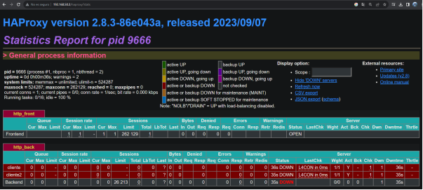
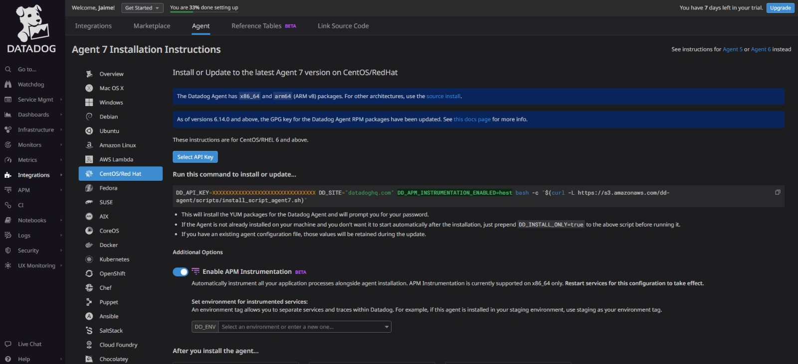
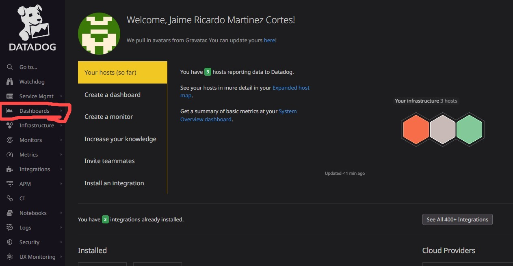
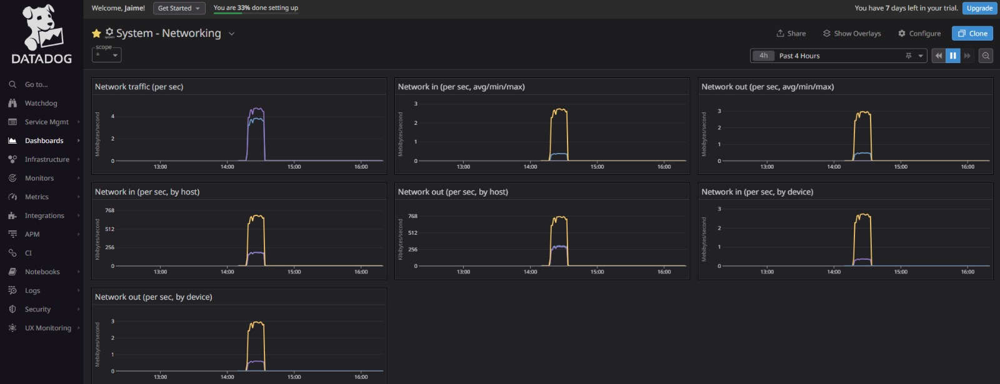
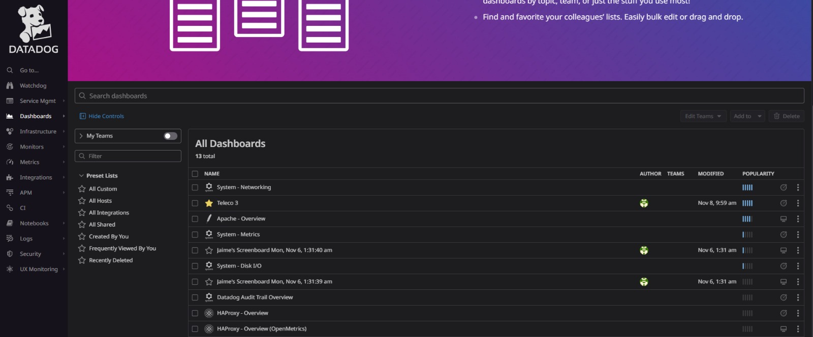

# Balanceador de carga con haproxy y Datadog

## Descripción.
Este proyecto proporciona una guía detallada sobre la configuración de un balanceador de cargas utilizando HAProxy junto con tres máquinas CentOS. Además, se integra Datadog como una interfaz de monitoreo para evaluar el rendimiento de una de las máquinas, en particular, el servidor HAProxy.

## Requisitos previos
Antes de comenzar con la configuración del balanceador de cargas, se deben cumplir los siguientes requisitos:

1. Tener tres máquinas virtuales de Centos instaladas y configuradas en la misma red.
2. Tener privilegios de superusuario en las tres máquinas, que para eso se usa el comando "sudo -i".
3. Tener instalado HAProxy en la máquina que actuará como balanceador de cargas.  
## Creacion del archivo Vagrantfile
Se debe ejecutar el comando `Vagrant init` para crear el archivo y se configura asi en cualqier editor de texto.

	Vagrant.configure("2") do |config|
	  if Vagrant.has_plugin? "vagrant-vbguest"
		config.vbguest.no_install = true
		config.vbguest.auto_update = false
		config.vbguest.no_remote = true
	  end
	  config.vm.define :cliente do |cliente|
		cliente.vm.box = "generic/centos9s"
		cliente.vm.network :private_network, ip: "192.168.50.2"
		cliente.vm.network :forwarded_port, guest: 80, host:5567
		cliente.vm.network :forwarded_port, guest: 443, host:5568
		cliente.vm.hostname = "cliente"
		cliente.vm.synced_folder "C:/Users/JR/prueba", "/home/vagrant/teleco"
	  end
	  config.vm.define :servidor do |servidor|
		servidor.vm.box = "generic/centos9s"
		servidor.vm.network :private_network, ip: "172.16.0.3"
		servidor.vm.network :private_network, ip: "192.168.50.3"
		servidor.vm.hostname = "servidor"
		servidor.vm.synced_folder "C:/Users/JR/prueba", "/home/vagrant/teleco"
	  end
	  config.vm.define :cliente2 do |cliente2|
		cliente2.vm.box = "generic/centos9s"
		cliente2.vm.network :private_network, ip: "192.168.50.4"
		cliente2.vm.hostname = "cliente2"
		cliente2.vm.synced_folder "C:/Users/JR/prueba", "/home/vagrant/teleco"
	  end
	end
 
Una vez que hayas configurado el archivo Vagrantfile, procede ejecutando el comando vagrant up para crear las tres máquinas virtuales. Además, es importante verificar que SELinux esté desactivado. Puedes hacerlo ejecutando el comando 'sestatus'. Si SELinux está habilitado, deberás seguir estos pasos para desactivarlo:

1.Abre un editor de texto como `vim` o `nano` y accede al archivo /etc/selinux/config.

2.Dentro de este archivo, busca la línea que contiene `SELINUX=enabled` si SELinux está habilitado.

3.Para desactivarlo, simplemente cambia 'enabled' por `disabled`, de la siguiente manera: `SELINUX=disabled`.

Con respecto al firewall (firewalld), puedes verificar su estado ejecutando service firewalld status. Si muestra que está activo, puedes desactivarlo ejecutando el siguiente comando: `systemctl stop firewalld`.

# Configuración.
## Configuración de las máquinas virtuales.
1. Configuración de la primera máquina virtual

* Nombre de la maquina: servidor 
* IP: 192.168.50.3
* Sistema operativo: Centos 9
* Servidor  instalado: haproxy y datadog-agent  

**Para configurar HAProxy en tu sistema, sigue estos pasos**:

- Instala los compiladores y dependencias necesarias utilizando el siguiente comando: `yum install gcc pcre-devel tar make -y`.

- Descarga el paquete de HAProxy utilizando wget. Puedes hacerlo con el siguiente comando: `wget https://www.haproxy.org/download/2.8/src/haproxy-2.8.3.tar.gz`.

- Descomprime el archivo descargado usando el siguiente comando: `tar -xzf haproxy-2.8.3.tar.gz`.

- Ingresa al directorio descomprimido de HAProxy: `cd haproxy-2.8.3`.

- Compila HAProxy para tu sistema. Asegúrate de usar el comando correcto: `make TARGET=linux-glibc`.

- Instala HAProxy en tu sistema: `make install`.	

- Finalmente, inicia el servicio de HAProxy: `sudo systemctl start haproxy`.

Con estos pasos, habrás instalado y configurado HAProxy en tu sistema CentOS. Asegúrate de haber ejecutado los comandos con permisos de superusuario o con el uso del comando sudo cuando sea necesario.

2. Configuración de la segunda máquina virtual
* Nombre de la maquina: backend1
* IP: 192.168.50.4
* Sistema operativo: Centos 9
* Servidor web instalado: Apache  
Se debe instalar el servicio de apache2 con el siguiente comando: `apt install apache2`, una vez instalado se debe crear un archivo index.html el cual se crea en la ruta `var/www/html` y por ultimo se Ejecuta el siguiente comando para iniciar el servicio de Apache: `sudo systemctl start apache2`.
 

3. Configuración de la tercera máquina virtual
* Nombre de la maquina: backend2
* IP: 192.168.50.4
* Sistema operativo: Centos 9
* Servidor web instalado: Apache  
Se debe instalar el servicio de apache2 con el siguiente comando: `apt install apache2` una vez instalado se debe crear un archivo index.html el cual se crea en la ruta `var/www/html` y por ultimo se Ejecuta el siguiente comando para iniciar el servicio de Apache: `sudo service apache2 start`.

# Configuración del balanceador de cargas

1. Instalar los compiladores en la máquina servidor que servira.
2. Instalar HAProxy en la máquina que actuará como balanceador de cargas en este caso es la maquina con el nombre de servidor.
3.para que funcione el haproxy se debe crear ciertos directorios los cuales son los siguiente:
- `mkdir -p /etc/haproxy`
- `mkdir -p /var/lib/haproxy`
- `touch /var/lib/haproxy/stats`
- `ln-s /usr/local/sbin/haproxy/usr/sbin/haproxy`
- `cp ~/haproxy-2.8.3/examples/haproxy.init/etc/init.d/haproxy`
- `chmod 755 /etc/init.d/haproxy`
- `systemctl daemon-reload`
- `chkconfig haproxy on`
4. Crear un archivo de configuración para HAProxy en `/etc/haproxy/haproxy.cfg`.
5. Configurar el archivo de configuración de HAProxy de la siguiente manera:
  
		global
        		log /dev/log local0
        		log /dev/log local1 notice
        		chroot /var/lib/haproxy
        		stats timeout 30s
        		user haproxy
        		group haproxy
        		daemon

		defaults
        		log global
        		mode http
        		option httplog
        		option dontlognull
        		timeout connect 5000
        		timeout client 50000
        		timeout server 50000

		frontend http_front
       			 bind *:80
        		stats uri /haproxy? stats
        		stats auth admin:admin
        		default_backend http_back

		backend http_back
        		balance roundrobin
   			server cliente 192.168.50.2:80 check
        		server cliente2 192.168.50.4:80 check

  
4. Vamos al directorio `/etc/datadog-agent/conf.d/haproxy.d/conf.yaml`, Este codigo es el enlace de Datadog con Haproxy.

5. Reiniciar HAProxy para aplicar los cambios, para esto se utiliza este codigo `service haproxy restart`.

6. Se accede a la ip de la máquina frontend por medio de un buscador que en nuestro caso es google.

    

# Uso
Para usar el balanceador de cargas con HAProxy y tres máquinas de Centos9, sigue los siguientes pasos:

1. Accede al balanceador de cargas a través de su dirección IP en este caso es la maquina con el nombre de servidor "192.168.50.3".
2. La solicitud será dirigida a uno de los dos servidores web de manera aleatoria asi:

# Configuración de Datadog

1. Crear la cuenta en datadog dando click en prueba gratuita.

3. luego llenas tus datos personales.
4. Te pidiran que instales el agente de datadog asi:

lo cual utilizas tu API KEY y utilizas el comando en la maquina en la que deseas instalar el agente datadog.
5. Una vez configurado el agente de datadog en la maquina damos click en infraestructura y despues en  mapa de anfitrion nos debe dejar observar el host asi:

6. luego vamos al apartado de dashboards y damos click en new dashboard y creamos.

7. Una vez creado el dashboard damos click en add widgets or Powerpacks.

8. Nos mostrara la siguiente ventana donde podemos escoger el tipo de grafico deseado.

9. Una vez se escoja el grafico se procede a configurar las metricas que se quieren visualizar y se dan click en save.

10. luego podemos observar el grafico ya creado en nuestro dashboard.
  
Y asi podemos seguir creando los graficos deseados para nuestro dashboard.
# Contacto
Si tienes preguntas o sugerencias sobre este proyecto, por favor contáctame en mi correo electrónico: [joshep.peralta@uao.edu.co]:.
